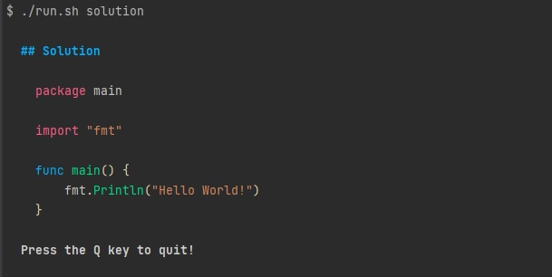

# learnyougo

A set of quiz and tasks to learn the go language at your own pace. It is inspired from `learnyounode`

## How to build

To build the project run the below command

```bash
./run.sh
```

The command has a dependency on `docker` being installed on the system.

## Screenshots



## Add new question

To add a new question to the database run the below command